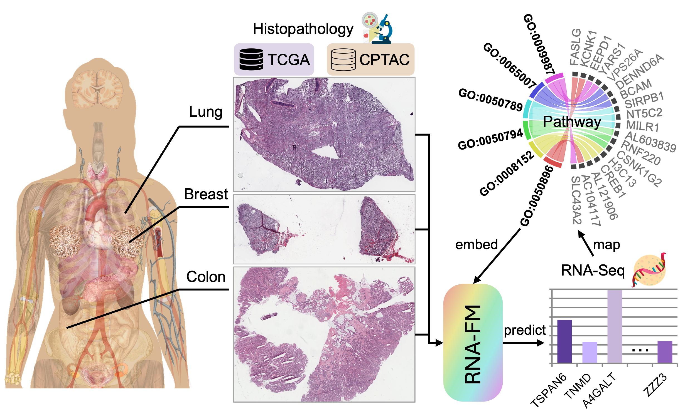
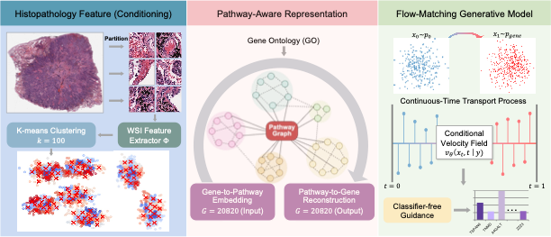

# RNA-FM

### Flow-Matching Generative Modeling for Genome-Wide RNA-Seq Prediction from Histopathology

This repository contains the official implementation of our ICML 2026 paper.

<p align="right">
  
</p>

_Histopathology whole-slide images (WSIs) are routinely acquired in clinical practice and contain rich tissue morphology but lack direct molecular architecture and functional programs defining pathological states, whereas RNA sequencing (RNA-seq) provides genome-wide transcriptional profiles at substantial cost, thereby motivating WSI-based genome-wide transcriptomic prediction. Existing approaches for predicting gene expression from WSIs predominantly rely on deterministic regression with one-to-one mapping, limiting their ability to capture biological heterogeneity and predictive uncertainty. We propose RNA-FM, a flow-matching generative framework for genome-wide bulk RNA-seq prediction from WSIs. RNA-FM formulates transcriptomic prediction as a continuous-time conditional transport problem, learning a velocity field that maps a simple prior to the target gene expression distribution conditioned on morphologies. By integrating pathway-level structure, RNA-FM enables scalable and biologically interpretable genome-wide gene expression imputation. Extensive experiments demonstrate that RNA-FM consistently outperforms state-of-the-art approaches while maintaining biological meaningfulness._


## Highlights
- **Generative transcriptomic prediction:** RNA-FM models WSI-to-RNA prediction as a continuous-time conditional flow-matching problem.
- **Genome-wide output:** the model predicts thousands of genes jointly, using pathway-aware gene organization to scale beyond small marker panels.
- **Morphology-conditioned transport:** clustered WSI patch features condition the learned velocity field that transports noise to RNA-seq profiles.
- **Biological structure:** Gene Ontology pathway groupings are used to organize genes and encourage pathway-level interpretability.


## Overview

<p align="center">
  
</p>


## Repository Structure

```text
RNA-FM/
├── examples/         # Reference CSVs, gene lists, and pathway-index files
├── evaluation/       # Evaluation and downstream analysis scripts
├── patient_splits/   # Cohort patient split metadata
├── pre_processing/   # WSI patching, feature extraction, k-means, and reference generation
├── scripts/          # Example preprocessing, training, and testing shell scripts
└── src/              # RNA-FM models, training loops, baselines, and transport modules
```

Important entry points:

- `src/main_RNAFM.py`: training and cross-validation for RNA-FM.
- `src/main_RNAFM_external_test.py`: external-cohort evaluation from trained checkpoints.
- `src/model_RNAFM.py`: pathway-aware RNA-FM model definition.
- `src/transport/`: flow-matching paths, samplers, and integration utilities.
- `evaluation/evaluate_model_RNAFM.py`: aggregate TCGA fold predictions and compute gene-level metrics.
- `evaluation/evaluate_model_RNAFM_external.py`: evaluate predictions on external cohorts.

## Installation

Clone the repository and create an environment:

```bash
git clone https://github.com/YXSong000/RNA-FM.git
cd RNA-FM
conda create -n rnafm python=3.9
conda activate rnafm
```

Install core dependencies:

```bash
conda install -c conda-forge openslide
pip install torch torchvision torchaudio
pip install numpy pandas scipy scikit-learn statsmodels tqdm h5py wandb openslide-python
```

If you use UNI patch features, install UNI following the official instructions from the [Mahmood Lab UNI repository](https://github.com/mahmoodlab/UNI).


## Data Format

Most workflows start from a reference CSV with one row per WSI. The file should contain:

- `wsi_file_name`: path to the WSI file.
- `patient_id`: patient identifier used for matching slides and RNA profiles.
- `rna_{GENE}` columns: gene-expression values, one column per target gene.
- Optional cohort metadata columns, such as `tcga_project`.

Example reference files are provided in `examples/`:

- `examples/reference_BRCA.csv`
- `examples/reference_COAD.csv`
- `examples/reference_LUAD.csv`
- `examples/reference_CPTAC_BRCA.csv`
- `examples/reference_CPTAC_COAD.csv`
- `examples/reference_CPTAC_LUAD.csv`

The target gene list is stored in `examples/gene_list.csv`. Pathway-to-gene-index mappings used by RNA-FM are stored in:

- `examples/all_gene_indices_filtered.json` (GOBP)
- `examples/all_gene_indices_molecular_function.json` (GOMF)

## Preprocessing

RNA-FM consumes per-slide feature files generated from WSI patches. Example preprocessing scripts are available for TCGA and CPTAC cohorts:

```bash
bash scripts/preprocess_TCGA_BRCA.sh
bash scripts/preprocess_TCGA_COAD.sh
bash scripts/preprocess_TCGA_LUAD.sh

bash scripts/preprocess_CPTAC_BRCA.sh
bash scripts/preprocess_CPTAC_COAD.sh
bash scripts/preprocess_CPTAC_LUAD.sh
```

Each preprocessing script follows the same high-level pipeline:

1. Extract WSI patches with `pre_processing/patch_gen_hdf5.py`.
2. Compute patch embeddings with `pre_processing/compute_features_hdf5.py`.
3. Aggregate patch embeddings into slide-level k-means cluster features with `pre_processing/kmean_features.py`.

For example, the BRCA preprocessing script creates patch HDF5 files, ResNet features, UNI features, and 100-cluster slide representations. The resulting feature directories are passed to RNA-FM through `--feature_path`.

## Training RNA-FM

To train RNA-FM on a TCGA cohort, edit the paths cohort name and GPU ID in `scripts/run_train_RNA-FM.sh`, then run:

```bash
bash scripts/run_train_RNA-FM.sh
```

The main training command has the following form:

```bash
python3 src/main_RNAFM.py \
  --model_type RNAFM \
  --ref_file examples/reference_LUAD.csv \
  --feature_path ./bulk_rna/LUAD/uni_features \
  --save_dir ./rna_ckpts/output \
  --cohort LUAD \
  --exp_name LUAD_uni_GOBP_ckpt \
  --depth 7 \
  --num_heads 8 \
  --batch_size 32 \
  --k 5 \
  --num_epochs 2000 \
  --num_sampling_steps 20 \
  --sampling_method euler \
  --cfg_scale 2.0 \
  --hidden_dim 256 \
  --lr 1e-4 \
  --train \
  --pathway_gene_indices_file ./examples/all_gene_indices_filtered.json \
  --gpu_id 0
```

Key arguments:

- `--ref_file`: reference CSV containing WSI paths and RNA values.
- `--feature_path`: directory containing extracted slide features.
- `--cohort`: cohort name used in output folders (LUAD, COAD, BRCA).
- `--exp_name`: experiment name used for logs and checkpoints.
- `--k`: number of cross-validation folds.
- `--pathway_gene_indices_file`: pathway grouping used by the RNA-FM gene embedder.
- `--cfg_scale`: classifier-free guidance scale used during sampling.
- `--num_sampling_steps`: number of ODE/SDE sampling steps for RNA generation.


## External Evaluation

After training, evaluate a checkpoint on an independent cohort, such as CPTAC, with:

```bash
bash scripts/run_external_test_RNA-FM.sh
```

The command uses `src/main_RNAFM_external_test.py` and expects:

- `--ref_file`: reference CSV for the external cohort.
- `--feature_path`: preprocessed external WSI features.
- `--ckpt_path`: trained RNA-FM checkpoint directory.
- `--pathway_gene_indices_file`: the same pathway mapping used during training.

Example:

```bash
python3 src/main_RNAFM_external_test.py \
  --model_type RNAFM \
  --ref_file examples/reference_CPTAC_LUAD.csv \
  --feature_path ./bulk_rna/CPTAC_LUAD/uni_features \
  --save_dir ./rna_ckpts/output \
  --cohort CPTAC_LUAD \
  --ckpt_path ./rna_ckpts/output/LUAD/LUAD_uni_GOBP_ckpt \
  --exp_name LUAD_uni_GOBP_ckpt \
  --depth 7 \
  --num_heads 8 \
  --batch_size 32 \
  --k 5 \
  --num_sampling_steps 20 \
  --sampling_method euler \
  --cfg_scale 2.0 \
  --hidden_dim 256 \
  --pathway_gene_indices_file ./examples/all_gene_indices_filtered.json \
  --gpu_id 0
```

## Baselines

This repository also includes scripts for baseline models used in comparison:

- `scripts/run_train_he2rna.sh`: HE2RNA-style MLP aggregation.
- `scripts/run_train_tRNAsformer.sh`: transformer-based RNA prediction baseline.
- `scripts/run_train_sequoia.sh`: SEQUOIA-style aggregation.

The corresponding implementations are in `src/main_he2rna.py`, `src/main_tRNASformer_sequoia.py`, `src/tformer_lin.py`, and `src/vit.py`.


## Citation

If RNA-FM is useful for your research, please cite our ICML 2026 paper:

```bibtex
@inproceedings{rnafm2026,
  title     = {RNA-FM: Flow-Matching Generative Modeling for Genome-Wide RNA-Seq Prediction from Histopathology},
  author    = {Song, Yixuan and co-authors},
  booktitle = {Proceedings of the 43rd International Conference on Machine Learning},
  year      = {2026}
}
```


